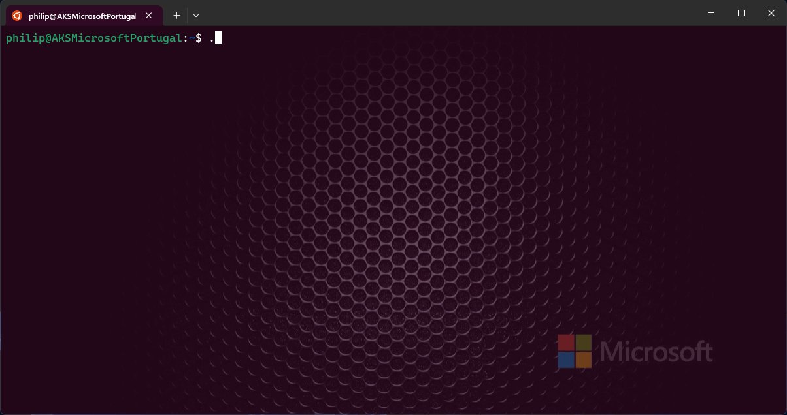
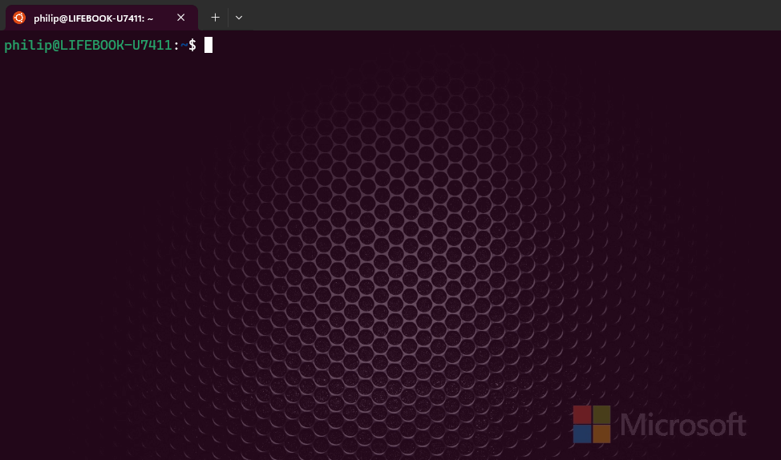
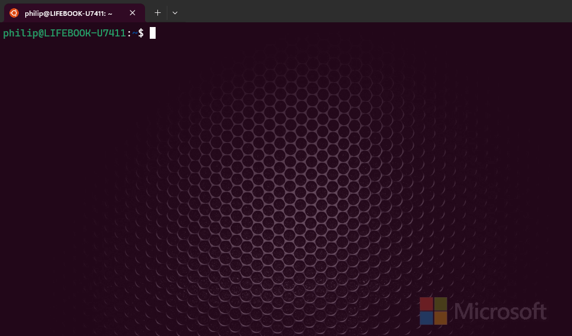

# <p align="center">🔧 Azure Kubernetes Tools (AKS)</p>

<!--START-->
<a class="github-button" href="https://github.com/PhilipMello" data-color-scheme="no-preference: light; light: light; dark: dark;" data-size="large" aria-label="Follow @PhilipMello on GitHub">Follow @PhilipMello</a>
<!--END-->

<!--START-->
<a class="github-button" href="https://github.com/PhilipMello/kubernetes/subscription" data-color-scheme="no-preference: light; light: light; dark: dark;" data-icon="octicon-eye" data-size="large" aria-label="Watch PhilipMello/kubernetes on GitHub">Watch</a>
<!--END-->

<!--START-->
<a class="github-button" href="https://github.com/PhilipMello/kubernetes/fork" data-color-scheme="no-preference: light; light: light; dark: dark;" data-icon="octicon-repo-forked" data-size="large" aria-label="Fork PhilipMello/kubernetes on GitHub">Fork</a>
<!--END-->

# 📝 About
## Free tools for Kubernetes (k8s)

```
wget https://raw.githubusercontent.com/PhilipMello/kubernetes/main/aks-tool && chmod +x aks-tool
```

# 📚 Index
🔖 [AKS Tool](#-aks-tool)<br>
🔖 [Service Principal Name (SPN) RESET](#-service-principal-name-spn-reset)<br>
🔖 [AKS Cluster State Check](#-aks-cluster-state-check)<br>
🔖 [MSI SPN Check](#-msi-spn-check)<br>
🔖 [AKS Create](#-aks-create)<br>

---
# 🔧 AKS Tool



---

# 🔧 Service Principal Name (SPN) RESET

### Microsoft Official Documentation
[Update or rotate the credentials for an Azure Kubernetes Service (AKS) cluster | Microsoft Learn](https://learn.microsoft.com/en-us/azure/aks/update-credentials#update-or-create-a-new-service-principal-for-your-aks-cluster "Update or rotate the credentials for an Azure Kubernetes Service (AKS) cluster | Microsoft Learn")



---
# 🔧 AKS Cluster State Check



---
# 🔧 MSI SPN Check

### Microsoft Official Documentation
[Service principal names | Microsoft Learn](https://learn.microsoft.com/en-us/windows/win32/ad/service-principal-names "Service principal names | Microsoft Learn")<br>
[Use a service principal with Azure Kubernetes Service (AKS)](https://learn.microsoft.com/en-us/azure/aks/kubernetes-service-principal?tabs=azure-cli "Use a service principal with Azure Kubernetes Service (AKS) | Microsoft Learn")<br>


---
# 🔧 AKS Create

### Microsoft Official Documentation
[az aks create (aks-preview extension) | Microsoft Learn](https://learn.microsoft.com/en-us/cli/azure/aks?view=azure-cli-latest#az-aks-create "az aks create (aks-preview extension)")


