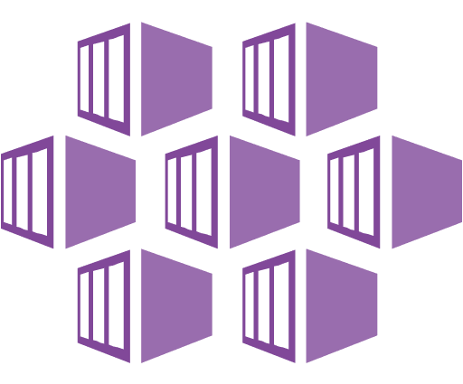
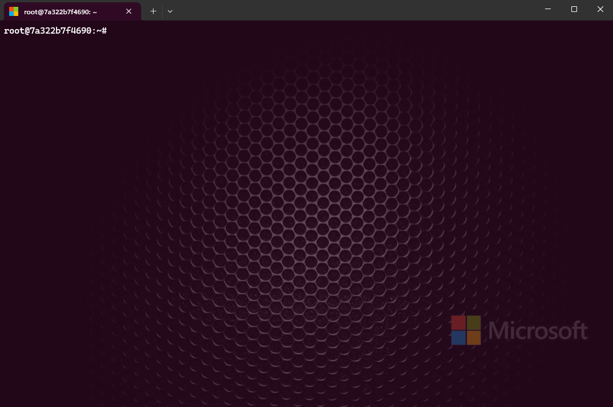
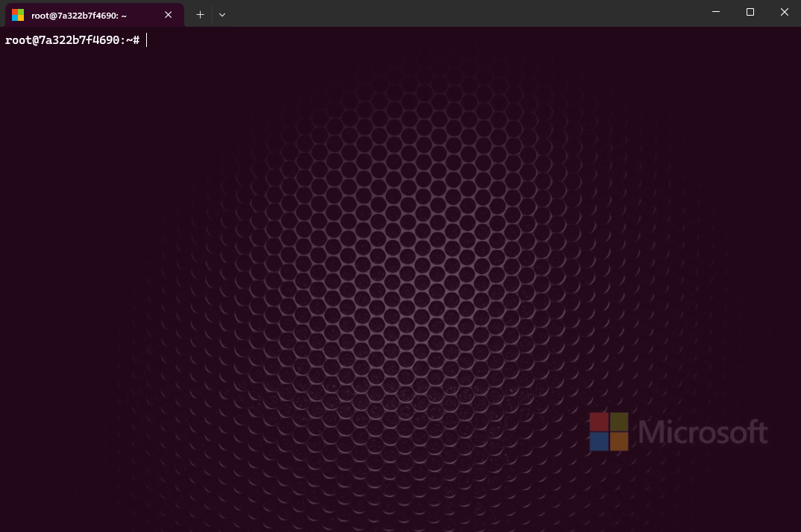

# <p align="center">🔧 Azure Kubernetes Tools (AKS)</p>

# 📝 About
## Free tools for Kubernetes (k8s)

# 📚 Index
🔖 [Downloading and Installing](#-downloading-and-installing)<br>
🔖 [Navigating the tool](#-navigating-the-tool)<br>

---
# 🔧 Downloading and Installing

```
wget https://raw.githubusercontent.com/PhilipMello/kubernetes/main/ktool && chmod +x ktool
```
OR
```
wget https://raw.githubusercontent.com/PhilipMello/kubernetes/main/ktool && chmod +x ktool && sudo mv ktool /usr/bin/
```



---

# 🔧 Navigating the tool



---

# 🔧 Service Principal Name (SPN) RESET

### Microsoft Official Documentation
[Update or rotate the credentials for an Azure Kubernetes Service (AKS) cluster | Microsoft Learn](https://learn.microsoft.com/en-us/azure/aks/update-credentials#update-or-create-a-new-service-principal-for-your-aks-cluster "Update or rotate the credentials for an Azure Kubernetes Service (AKS) cluster | Microsoft Learn")


---
# 🔧 AKS Cluster State Check


---
# 🔧 MSI SPN Check

### Microsoft Official Documentation
[Service principal names | Microsoft Learn](https://learn.microsoft.com/en-us/windows/win32/ad/service-principal-names "Service principal names | Microsoft Learn")<br>
[Use a service principal with Azure Kubernetes Service (AKS)](https://learn.microsoft.com/en-us/azure/aks/kubernetes-service-principal?tabs=azure-cli "Use a service principal with Azure Kubernetes Service (AKS) | Microsoft Learn")<br>


---
# 🔧 AKS Create

### Microsoft Official Documentation
[az aks create (aks-preview extension) | Microsoft Learn](https://learn.microsoft.com/en-us/cli/azure/aks?view=azure-cli-latest#az-aks-create "az aks create (aks-preview extension)")


